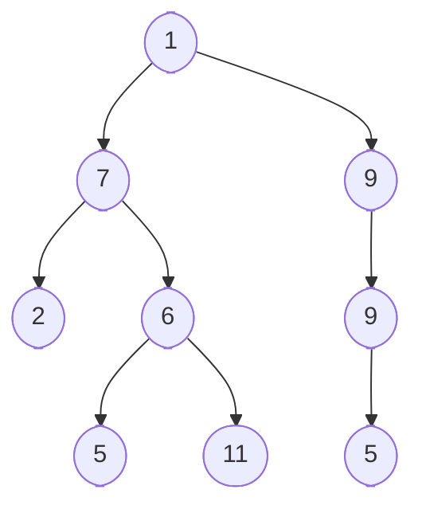

# Binary tree

A binary tree is a tree where each node has a max of two children. A complete
binary tree is a binary tree where every level is completely filled. A balance
binary tree is a binary tree where the right and left sub-trees of every node
differ by no more than 1 level.

## Traversals

Given the following binary tree:

- **In-order traversal:** Left -> Root -> Right
  - 2, 7, 5, 6, 11, 1, 9, 5, 9
- **Pre-order traversal:** Root -> Left -> Right
  - 1, 7, 2, 6, 5, 11, 9, 9, 5
- **Post-order traversal:** Left -> Right -> Root
  - 2, 5, 11, 6, 7, 5, 9, 9, 1

## References

- [Tech-Interview-Handbook](/reference/Tech-Interview-Handbook)
