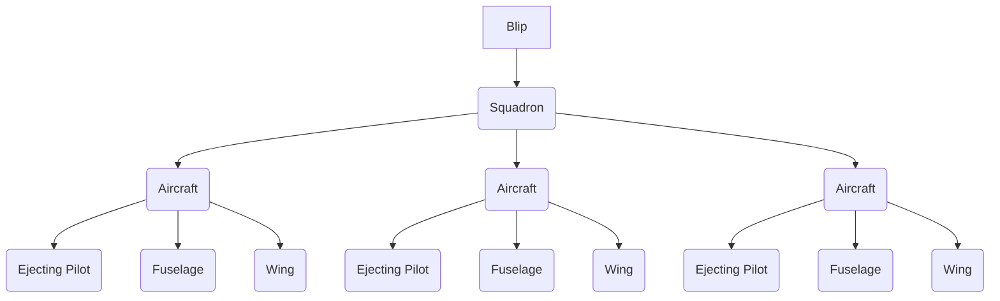
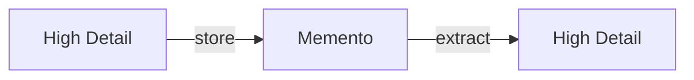

# Hierarchical Level of Detail & Implicit State

Hierarchical level of detail (HLOD) is a technique where an entity gains or
loses detail depending on how relevant it currently is to the user or system.
This can even be as extreme as having the entity no longer exist. Since entities
can be implicit based on their components and attributes, we can optimize their
performance by only loading those components that are relevant.

For example, if 100,000 objects are being observed from a great distance away,
it is more efficient to render those objects at a lower resolution since finer
details would be impossible to perceive at that distance. The level of detail
heuristic can be fine tuned so that the most relevant objects are always at the
highest level of detail, while other objects may be reduced to a lower level.



## Memento

A memento is taking some high detail entity and compressing it down to just the
necessary instructions to rebuild that entity when it is needed later.



If an entity becomes so irrelevant to the user, the memento can be discarded. We
can manually discard a memento to improve performance in a way that is obvious
or even initiated by the user. Monster's resetting at night, sleeping until
morning, or the Moon resetting the world to three days in the past are all
examples of manually discarding mementos.

### Just in time mementos

Mementos can also be generated just in time. It is possible to seed a generator
with details about the entity that needs to be created. This means that while we
are still generating a memento, we don't have to worry about having the overhead
of storing it, nor do we need to worry about the lifetime of the memento.

```go
type House struct {
  Size       string
  Rooms      int
  PaintColor string
}

func GenerateHouse(location string) House {
  house := House{}

  var seed int64
  for _, char := range location {
    seed += int64(char)
  }
  rng := rand.New(rand.NewSource(seed))

  sizes := []string{"small", "medium", "large"}
  sizeIndex := rng.Intn(len(sizes))
  house.Size = sizes[sizeIndex]

  switch size {
  case "small":
    house.Rooms = rng.Intn(2) + 2 // 2 or 3 rooms
  case "medium":
    house.Rooms = rng.Intn(3) + 4 // 4, 5, or 6 rooms
  case "large":
    house.Rooms = 7 + int(rng.Float64()*10) // 7 to 16 rooms
  }

  colors := []string{"red", "blue", "green", "yellow", "white", "gray", "brown"}
  colorIndex := rng.Intn(len(colors))
  house.PaintColor = colors[colorIndex]

  return house
}
```

## Alternative Axes

Distance should not always be considered as the go-to axis for level of detail.
In game development, distance from the camera isn't what is critical, the amount
of perception an entity takes up is. A large object that is far away takes up
the same amount of perception as a small object that is closer. Taking this idea
further, we can measure perception as the probability of a user caring about an
object. Thinking about recollection and attention as measurable quantities we
can start reasoning about solutions.

An entity that has the users attention, but is hidden, still maintains a large
stake on their perception. That warrants higher priority for level of detail
than it normally would deserve. This then raises the question of how long until
the user forgets about something that might otherwise be important? Periodically
removing objects that are not interacted with while keeping mementos of objects
that do see interaction can be very effective at reducing memory usage.

State can also be manipulated by progress on an axis. Tutorials, animations,
reminders, and other elements can all be manipulated by some level of detail
axis. A tutorial for a particularly feature could appear depending on the axis
of "how many interactions" or "time since seen" and these values could be reset
if that feature receives a major overhaul. This approach is a lot safer for
managing state and for avoiding transition errors.

Transition errors happen when moving from one state to another sets a value to
`true` one way, but doesn't set that value `false` when transitioning back.
State like this is implicit when traveling along the axis and since it's a
metric that is being observed rather than directly modified, it's less prone to
inconsistency.
