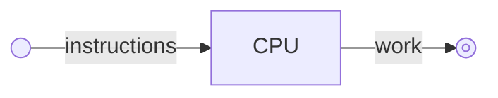

# Performance

Optimization is taking a program and attempting to maximize performance on a
specific set of hardware. This often requires very intimate knowledge of the
hardware, outside of the box hardware manipulation techniques, and all sorts of
black magic. Because of this, modern programmers often disregard optimization as
being too complicated, too specialized, and just not worth the effort. All of
this is completely true when it comes to traditional optimization techniques.

However, common software practices have led us down a road where most software
is incredibly slow. It is fairly common for an application to run 1,000 times
slower than what it is capable of and this is not hyperbole. There is no
business case for traditional optimization, but there is a resounding case for
learning the basics of performance in order to make informed decisions. It has
been proven time and time again that performance improvements lead to great user
experience and to cheaper server bills.

If you can learn how to use CSS or SQL, you can understand the CPU.

## CPU

The CPU can be generalized as a black box that takes in instructions and outputs
work. Performance is measure by how long it takes the CPU to execute the
instructions it is given. Therefore, performance can really only be manipulated
two ways:

- Reduce the number of instructions
- Change the speed at which the CPU executes those instructions

This first point is pretty obvious, but how can we change the execution speed on
instructions? Modern CPUs will often have many different instructions that more
or less perform the same task just at different rates. Additionally, the order
that these instructions are executed matters. Knowing when to reorganize code so
the CPU can do work ahead of time can improve the speed of execution.

## What went wrong?

Programmers used to be aware of the actual instructions the CPU had to process.
Up until the 1990's, CPU architecture was pretty easy to understand. Now, modern
processors can be very overwhelming to wrap your head around and turn a lot of
developers away from even trying.

It requires a shift in the mental model. You need to stop thinking about the
language you are using, and start thinking about what instructions that language
will produce. Only then will you be able to make rough estimates about what the
CPU is capable of and what performance you should expect from your code.
