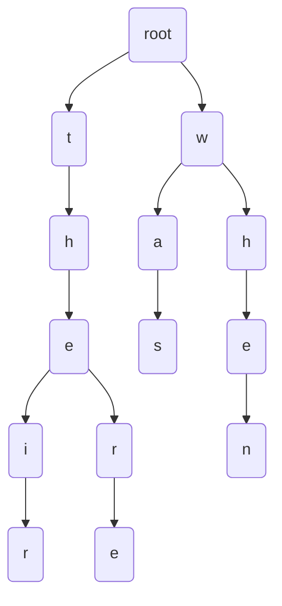

type: #idea
subject: [Data-Structures](Data-Structures.md)
<!-- Subject should be a hub note -->
# Trie

A trie is a [Tree](Tree.md) structure where each edge represents one character and the root is null. Each path from the root represents a string, described by the characters labeling the traversed edges.

## Time complexity

| Operation | Big-O |
|-----------|-------|
| Insert | O(n) |
| Search | O(n) |

## Auxiliary space

| Operation | Big-O | Notes |
|-----------|-------|-------|
| Insert | O(m * n) | m is the Alphabet size * key length |
| Search | O(1) | |

This is a trie of "there", "their", "when" and "was"



## Examples

### python

```python
ALPHABET_SIZE = 26

class TrieNode:
	def __init__(self):
		self.children = [None]*ALPHABET_SIZE
		self.isEndOfWord = False
		
class Trie
	def __init__(self):
		self.root = self.getNode()
		
	def getNode(self) -> TrieNode:
		return TrieNode()
		
	def _charToIndex(self, ch) -> int:
		# converts ch to index
		return ord(ch) - ord('a')
		
	def insert(self, key):
		pointerIndex = self.root
		length = len(key)
		for level in range(length):
			index = self._charToIndex(key[level])
			if not indexPointer.children[index]:
				pointerIndex.children[index] = self.getNode()
			pointerIndex = pointerIndex.children[index]
		pointerIndex.isEndOfWord = True
		
	def search(self, key) -> bool:
		pointerIndex = self.root
		length = len(key)
		for level in range(length):
			index = self._charToIndex(key[level])
			if not pointerIndex.children[index]:
				return False
			pointerIndex = pointerIndex.children[index]
		return pointerIndex.isEndOfWord
```

### go

```go
type TrieNode struct {
	children    map[rune]*TrieNode
	isEndOfWord bool
}

func NewTrieNode() *TrieNode {
	tn := &TrieNode{
		children:    make(map[rune]*TrieNode),
		isEndOfWord: false,
	}
	return tn
}

type Trie struct {
	root *TrieNode
}

func NewTrie() *Trie {
	t := &Trie{
		root: NewTrieNode(),
	}
	return t
}

func (t *Trie) Insert(key string) {
	current := t.root
	for _, index := range key {
		_, ok := current.children[index]
		if !ok {
			current.children[index] = NewTrieNode()
		}
		current = current.children[index]
	}
	current.isEndOfWord = true
}

func (t *Trie) Search(key string) bool {
	current := t.root
	for _, index := range key {
		_, ok := current.children[index]
		if !ok {
			return false
		}
		current = current.children[index]
	}
	return current.isEndOfWord
}
```

## Reference

[Tech-Interview-Handbook](Tech-Interview-Handbook.md)